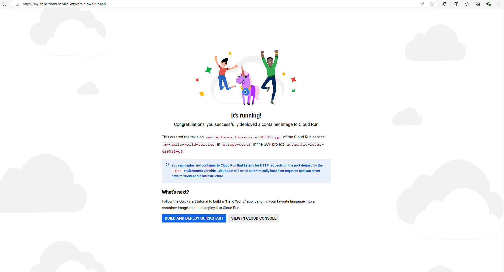

# Terraform Module for Deploying a "Hello World" Cloud Run Service

This Terraform module deploys a "Hello World" Cloud Run service.

## Overview

- Deploys a Cloud Run service using the `google_cloud_run_v2_service` resource (## Task 1)
- Modularity: The code is structured as a reusable Terraform module
- Creates a dedicated service account for the Cloud Run service with the minimal permissions required (roles/run.invoker) (## Task 2)
- The service account is granted the Cloud Run Invoker role, which allows it to invoke Cloud Run functions
- Creates a KMS key ring and crypto key for each environment (encrypts data at rest and in transit using customer-managed encryption keys (CMEK) with Cloud KMS.)
- Exposes the service through a global public load balancer by default
- Configures IAM to allow public access to the Cloud Run service (https://cloud.google.com/run/docs/authenticating/overview)
- Terraform provides an output for the service URL, you can use this URL to access the service
- With the google_cloud_run_v2_service resource, Cloud Run automatically provisions a global load balancer when you expose your service publicly
- Cloud Run automatically handles HTTPS/TLS certificates for the service when you expose it publicly
- Can deploy to multiple GCP projects by specifying different project_id values and allow environment-specific values in a .tfvars file (## Task 3)

## Additional info relating to further enhancements (out of scope in this exercise)
- You can consider additional security measures like VPC Service Controls, Cloud IAP, network security rules, and regular security audits for a production environment
- Further enhance security by using Ingress rules to control access to the service. For example, you can restrict access to specific IP addresses or use authentication mechanisms
- If you need more fine-grained control over ingress (e.g., integration with other load balancers), you can configure the ingress setting in the google_cloud_run_v2_service resource
- You can implement more specific IAM roles instead of using allUsers for the Cloud Run service
- Can integrate this Terraform code into a CI/CD pipeline to automate deployments and security checks

## Prerequisites

- Terraform installed (v1.9.2)
- Google Cloud Platform account
- Google Cloud project with billing enabled
- Google Cloud SDK authenticated to your project [Further details can be found here](https://cloud.google.com/docs/authentication/provide-credentials-adc#local-dev)

In order to run the deployment, Google authentication needs to be setup unless using Google Cloud Shell.

If a terraform service account is being used (with appropriate permissions), set the environment `GOOGLE_APPLICATION_CREDENTIALS` as follows:
```
export GOOGLE_APPLICATION_CREDENTIALS=/path-to-credentials.json
gcloud auth activate-service-account --key-file=$GOOGLE_APPLICATION_CREDENTIALS
```

If a user account is being used, execute the following:
```
gcloud auth login
gcloud auth application-default login
```

## Usage

## Run the following commands to deploy the service:

1. Clone this repository:
```
git clone https://github.com/zi01farm/gcp-devops.git
cd gcp-devops
``` 

2. Initialize Terraform:
```
terraform init
```

3. Edit the `terraform.tfvars` file with your specific values.
```   
project_id = "your-gcp-project-id"
env = "desired-environment"
```

Note: you can also create specific .tfvars files (terraform plan/apply -var-file={UNIQUE_FILENAME_NAME}.tfvars)

In addition to this, create a separate workspace for each .tfvars file. And then you can simply swap to a different workspace with terraform workspace select <workspace name> before running terraform plan/apply --var-file=<filename> with each individual .tfvars file.

```   
project_id = "your-gcp-project-id"
env = "staging"
```

```   
terraform workspace new staging
terraform workspace select staging
terraform init
terraform plan/apply -var-file=staging.tfvars
```

4. Review the planned changes:
```    
terraform plan -var-file=terraform.tfvars
``` 

5. Apply the Terraform configuration. Note: If you enabled any APIs recently, wait a few minutes for the action to propagate in your project and retry the apply
```    
terraform apply -var-file=terraform.tfvars
``` 

6. After the apply completes, note the outputs:
- `service_url`: Direct URL of the Cloud Run service

## Testing

1. Test the direct Cloud Run service:
```   
curl https://<service_url>
```
2. For browser testing:
```   
Visit `https://<service_url>` in your browser
```



## Clean Up

To delete your Cloud Run service and all associated resources, run the following command:
``` 
terraform destroy
```